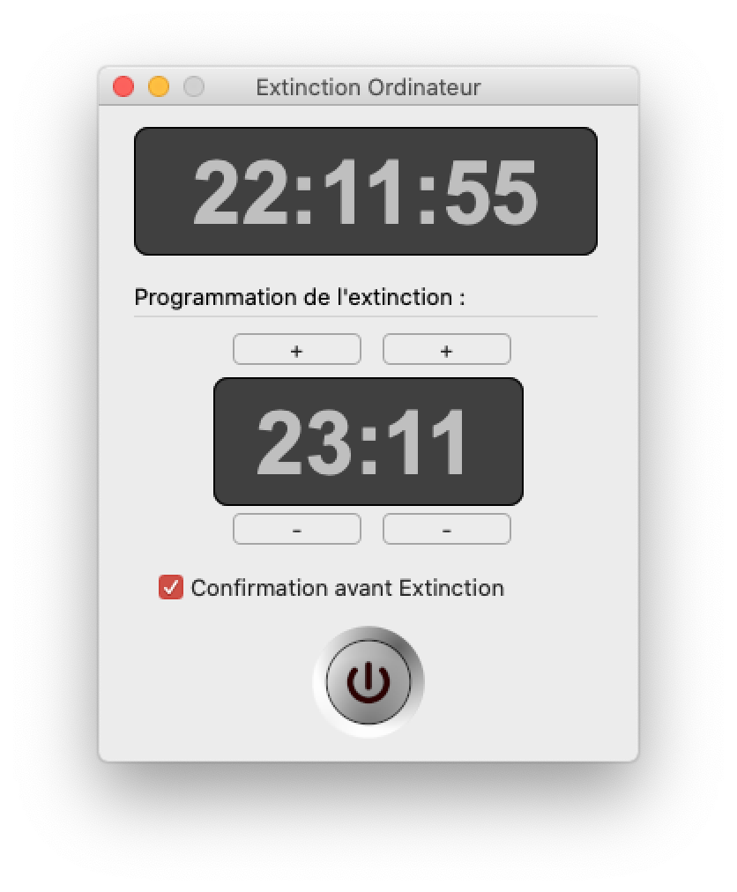

# ShutDown / Extinction
Logiciel permettant l'arrêt d'un PC ou d'un Mac Os // XOJO

Fonctionnalités : 
- Affichage de l'heure courante
- Paramétrage et affichage de l'heure d'arrêt
- Message avant Arrêt automatique
- Interface soignée

Historique des versions :
v0.10 : Dark Mode

Si vous aimez mes programmes, <a href="https://www.paypal.com/donate/?hosted_button_id=GY5LTDDPZ2HZG"> vous pouvez faire un don PayPal ;)</a>
